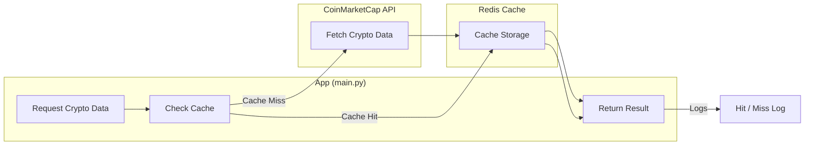

# 🚀 Redis Cache API

[](https://www.python.org/)
[](https://redis.io/)
[](https://www.docker.com/)
[](https://pre-commit.com/)

A lightweight project showcasing **API integration**, **caching strategies**, and **Dockerization**.
It connects to the [CoinMarketCap API](https://coinmarketcap.com/api/), fetches live cryptocurrency data ranked by market capitalization, and uses **Redis** to simulate **cache hits** and **cache misses** in real time.

## ✨ Key Features

- **CoinMarketCap API Integration** – Fetches real-time cryptocurrency data ranked by market cap.
- **Redis Caching** – Avoids redundant API calls and boosts performance.
- **Caching Simulation** – Logs cache hits and misses for better understanding of caching behavior.
- **Python 3.12 + Pipenv** – Modern Python environment with deterministic dependency management.
- **Dockerized Setup** – Run the entire stack (API + Redis) in isolated containers with `docker compose`.
- **Type-safe models** — `crypto_models.py` provides **TypedDicts** for function **arguments** and **return types**, improving IDE hints, refactors, and reliability.
- **Pre-commit Hooks** – Automated code formatting, linting, and commit validation.

## 🔀 Data Flow
The following diagram shows how the system interacts with the **CoinMarketCap API**, **Redis**, and the application logic:



## 📜 Example Output
When fetching data from the API and after some parsing, the application returns a dictionary-like JSON structure.

```json
{
    "1": {
        "name": "Bitcoin",
        "symbol": "BTC",
        "usd_price": 117398.28
    },
    "2": {
        "name": "Ethereum",
        "symbol": "ETH",
        "usd_price": 4424.62
    },
    ...
}
```
👉 The keys ("1", "2", …) represent the ranking by market capitalization.

👉 Each entry contains the name, symbol, and current USD price of the cryptocurrency.

## ⚡ Pre-commit Setup

This repository uses **pre-commit** to ensure every commit meets quality and style standards.
Configured hooks in `.pre-commit-config.yaml` include:

- **check-yaml** – validates `.yaml` files are syntactically correct.
- **end-of-file-fixer** – enforces a single newline at EOF (POSIX standard).
- **trailing-whitespace** – removes unnecessary whitespace.
- **isort** – automatically sorts and organizes imports.
- **black** – opinionated Python code formatter, ensuring consistent style.
- **flake8** – static code analysis to catch bugs, complexity, and style violations.
- **conventional-pre-commit** – enforces [Conventional Commits](https://www.conventionalcommits.org/) for structured commit messages and cleaner Git history.

👉 With this setup, **bad code and bad commits are stopped before they ever reach the repository**.

## ⚙️ Getting Started

### 1. Prerequisites
- [Docker](https://docs.docker.com/get-docker/) & [Docker Compose](https://docs.docker.com/compose/)
- [CoinMarketCap API Key](https://coinmarketcap.com/api/)

### 2. Clone the repository
```sh
git clone https://github.com/valemuchino/redis-cache-api.git
cd redis-cache-api
```

### 3. Configure environment variables
Create a .env file in the root directory:
```sh
COIN_MARKET_CAP_API_KEY=your_api_key_here
```

### 4. Run with Docker
```bash
docker compose up --build
```

### 5. Observe caching behavior
Check logs to see cache hits and misses when fetching cryptocurrency data.
